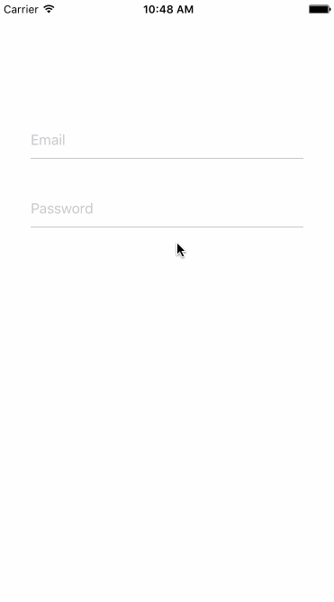

# React-Native-TextInputLayout
[](https://npmjs.org/package/rn-textinputlayout) [](https://npmjs.org/package/rn-textinputlayout) [](https://npmjs.org/package/rn-textinputlayout)

Pure js implemention material design TextInputLayout component for react-native, works on both android and ios.

## Preview



## Build and run the demo

```  
cd TextInputLayoutDemo/
npm install
react-native run-ios
```

## Usage

### Install from npm:
`npm install --save rn-textinputlayout`

### Integrate into your app:  

```jsx

'use strict';
import React, {Component} from 'react';
import {StyleSheet, View, TextInput, Text} from 'react-native';
import {TextInputLayout} from 'rn-textinputlayout';

const EMAIL_REGEX = /^(([^<>()\[\]\\.,;:\s@"]+(\.[^<>()\[\]\\.,;:\s@"]+)*)|(".+"))@((\[[0-9]{1,3}\.[0-9]{1,3}\.[0-9]{1,3}\.[0-9]{1,3}])|(([a-zA-Z\-0-9]+\.)+[a-zA-Z]{2,}))$/;
export default class TextInputLayoutDemo extends Component {

    render() {
        return (
            <View style={styles.container}>
                <TextInputLayout
                    style={styles.inputLayout}
                    checkValid={t => EMAIL_REGEX.test(t)}
                >
                    <TextInput
                        style={styles.textInput}
                        placeholder={'Email'}
                    />
                </TextInputLayout>
                <TextInputLayout style={styles.inputLayout}>
                    <TextInput
                        style={styles.textInput}
                        placeholder={'Password'}
                        secureTextEntry={true}
                    />
                </TextInputLayout>
            </View>
        );
    }
}
const styles = StyleSheet.create({
    container: {
        flex: 1,
        paddingTop: 100
    },
    textInput: {
        fontSize: 16,
        height: 40
    },
    inputLayout: {
        marginTop: 16,
        marginHorizontal: 36
    }
});
```

##Props
- hintColor
- borderColor
- errorColor
- focusColor
- labelFontSize
- labelText
- checkValid